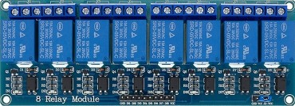
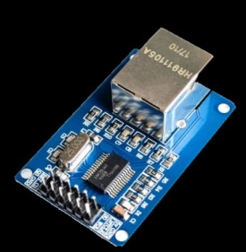
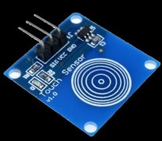
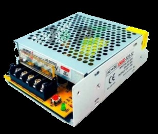
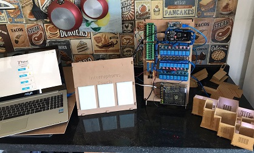
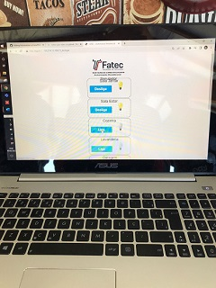
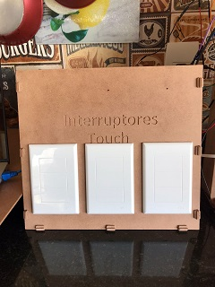
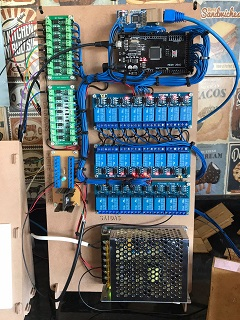
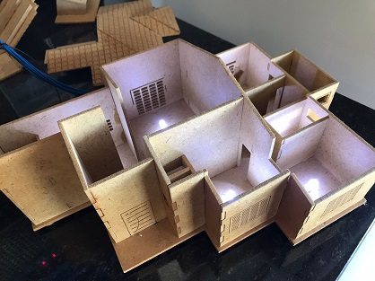

----

# Automatizar-a-Casa

----

 SISTEMAS EMBARCADOS 
 1° Semestre - FATEC Jundiaí
 
 Integrantes:
 - Cristiano Francisco Correa;
 - João Felipe Gustavo;
 - Luis Gustavo do Santos Rosa;
 - Nicollas de Oliveira Juliano;
 - Rafael Massayoshi Hamazaki;

----
# Sumário:

1 - Introdução;

2 - Materiais;

3 - Código-Fonte;

4 - Conclusão do Projeto;

5 - Link do vídeo;

----


# 1 - Introdução:

Projeto desenvolvido para a disciplina Sistemas Embarcados da FATEC - Jundiaí, visando implementar e disponibilizar à comunidade um sistema de baixo custo  em comparação ao que encontra-se comercialmente (como CLP's) que tem como finalidade apresentar a possibilidade de **automação residencial** com o Arduino Mega, com interação simultanea tanto **fisica** (**_Interruptores Touch_**), quanto **virtualmente** (acesso pela rede com o **_Módulo Ethernet_**). 


No **_Módulo Ethernet_**, o usuário utiliza um IP de Hospedagem próprio em seu dispositivo, permitindo conexão cabeada por computador, ou celular pelo roteador (ou qualquer outra opção para WEB) para realizar a manobra das "cargas", respectivamente ao sistema de iluminação da residência no nosso caso.

----

# 2 - Materiais utilizados:

+ Arduino Mega 2560;


+ Relés;



+ Módulo de Rede Ethernet W5500 ;



+ Placas Touch (Interruptores);



+ Módulo Opto-acoplador;

#####  - Proteção das entradas digitais entre os componentes;


+ Fonte de Alimentação 12V;



+ Lâmpadas

----

# 3 - Código-Fonte: 


```
//Placa rede utilizada W5500
//CS  > 10
//MOSI ou SI ou ST >  51
//MISO ou SO  >  50
//SCK  >  52
//RESET > RESET
//INT ou LNT >  2
//GND >  GND
//VCC > 5V

//INCLUSÃO PLACA REDE
#include <SPI.h>
#include <Ethernet2.h>
String readString;

//Variavel para incluir numeros randomicos para simulação de presença 
int randNumber;

boolean ligado_1 = true;
boolean ligado_2 = true;
boolean ligado_3 = true;
boolean ligado_4 = true;
boolean ligado_5 = true;
boolean ligado_6 = true;
boolean ligado_7 = true;
boolean ligado_8 = true;
//boolean ligado_X = true;
 
//Informacoes de endereco IP, gateway, mascara de rede

//Internet, para utilização com conclusão de testes e ajustes
//byte mac[] = { 0xA4, 0x28, 0x72, 0xCA, 0x55, 0x2F };
//byte ip[] = { 192, 168, 0, 110 };
//byte gateway[] = { 192, 168, 0, 1 };
//byte subnet[] = { 255, 255, 255, 0 };

//Cross Over, para testar internamente com servidor local
byte mac[] = { 0xA4, 0x28, 0x72, 0xCA, 0x55, 0x2F };
byte ip[] = { 169,254,13, 100 };
byte gateway[] = { 169,254,13, 124 };
byte subnet[] = { 255, 255, 0, 0 };

EthernetServer server(80);

//Pinos reservas para inclusão de hardware futuro
//int ANALOG_IN1 = A0;
//int ANALOG_IN2 = A1;
//int ANALOG_IN3 = A2;

//int PWM1 = 7;
//int PWM2 = 8;
//int PWM3 = 9;
//int PWM4 = 11;
//int PWM4 = 12;
//int PWM5 = 13;

//Variaveis de entradas, saidas e auxiliares
int SALAJANTAR = 34; 
int SALAJANTAR_E = 14;
int SALAJANTAR_E1;
int SALAJANTAR_R;
int valor1;
int anterior1 = 0;
int estado1 = LOW;
int SALAESTAR = 35; 
int SALAESTAR_E = 15;
int SALAESTAR_E1;
int SALAESTAR_R;
int valor2;
int anterior2 = 0;
int estado2 = LOW;
int COZINHA =36; 
int COZINHA_E = 16; 
int COZINHA_E1;
int COZINHA_R;
int valor3;
int anterior3 = 0;
int estado3 = LOW;
int LAVANDERIA = 37; 
int LAVANDERIA_E = 17; 
int LAVANDERIA_E1;
int LAVANDERIA_R;
int valor4;
int anterior4 = 0;
int estado4 = LOW;
int GARAGEM = 38; 
int GARAGEM_E = 18; 
int GARAGEM_E1;
int GARAGEM_R;
int valor5;
int anterior5 = 0;
int estado5 = LOW;
int VARANDA = 39; 
int VARANDA_E = 19; 
int VARANDA_E1;
int VARANDA_R;
int valor6;
int anterior6 = 0;
int estado6 = LOW;
int QUINTAL = 40; 
int QUINTAL_E = 20; 
int QUINTAL_E1;
int QUINTAL_R;
int valor7;
int anterior7 = 0;
int estado7 = LOW;
int CORREDOR = 41; 
int CORREDOR_E = 21; 
int CORREDOR_E1;
int CORREDOR_R;
int valor8;
int anterior8 = 0;
int estado8 = LOW;
int LAVABO = 42; 
int LAVABO_E = 22; 
int LAVABO_E1;
int LAVABO_R;
int valor9;
int anterior9 = 0;
int estado9 = LOW;
int BANHOSOCIAL = 43; 
int BANHOSOCIAL_E = 23; 
int BANHOSOCIAL_E1;
int BANHOSOCIAL_R;
int valor10;
int anterior10 = 0;
int estado10 = LOW;
int BANHOSUITE = 44; 
int BANHOSUITE_E = 24; 
int BANHOSUITE_E1;
int BANHOSUITE_R;
int valor11;
int anterior11 = 0;
int estado11 = LOW;
int SUITE = 45; 
int SUITE_E = 25; 
int SUITE_E1;
int SUITE_R;
int valor12;
int anterior12 = 0;
int estado12 = LOW;
int CLOSET = 46; 
int CLOSET_E = 26; 
int CLOSET_E1;
int CLOSET_R;
int valor13;
int anterior13 = 0;
int estado13 = LOW;
int QUARTO1 = 47; 
int QUARTO1_E = 27; 
int QUARTO1_E1;
int QUARTO1_R;
int valor14;
int anterior14 = 0;
int estado14 = LOW;
int QUARTO2 = 48; 
int QUARTO2_E = 28; 
int QUARTO2_E1;
int QUARTO2_R;
int valor15;
int anterior15 = 0;
int estado15 = LOW;
int SIMULADOR = LOW;
//int RESERVA1 = 49; 
//int RESERVA1_E = 30; 
//int X_E1;
//int valor16;
//int anterior16 = 0;
//int estado16 = LOW;
//int RESERVA2 = 2; 
//int RESERVA2_E = 31; 
//int valor17;
//int anterior17 = 0;
//int estado17 = LOW;
//int RESERVA3 = 3; 
//int RESERVA3_E = 31; 
//int valor18;
//int anterior18 = 0;
//int estado18 = LOW;
//int RESERVA4 = 4; 
//int RESERVA4_E = 32; 
//int valor19;
//int anterior19 = 0;
//int estado19 = LOW;
//int RESERVA5 = 5; 
//int RESERVA5_E = 33; 
//int valor20;
//int anterior20 = 0;
//int estado20 = LOW;
//int RESERVA6 = 6; 
//int X = X; 
//int X_E = X; 
//int valorX;
//int anteriorX = 0;
//int estadoX = LOW;


void setup() {

 Serial.begin(38400);
  
  //Inicializa Ethernet Shield
  Ethernet.begin(mac, ip, gateway, subnet);
  server.begin();
 
  Serial.println("Equipe Tesla - Automacao Residencial"); 

pinMode(CORREDOR, OUTPUT); 
pinMode(SALAESTAR, OUTPUT);
pinMode(SALAJANTAR, OUTPUT);
pinMode(GARAGEM, OUTPUT);
pinMode(COZINHA, OUTPUT); 
pinMode(LAVANDERIA, OUTPUT);
pinMode(LAVABO, OUTPUT); 
pinMode(VARANDA, OUTPUT);
pinMode(VARANDA, OUTPUT);
pinMode(QUINTAL, OUTPUT);
pinMode(BANHOSOCIAL, OUTPUT);
pinMode(BANHOSUITE, OUTPUT);
pinMode(BANHOSUITE, OUTPUT);
pinMode(BANHOSUITE, OUTPUT);
pinMode(SUITE, OUTPUT);
pinMode(CLOSET, OUTPUT);
pinMode(QUARTO1, OUTPUT);
pinMode(QUARTO2, OUTPUT);
pinMode(SUITE, OUTPUT); 
pinMode(CORREDOR_E, INPUT_PULLUP);
pinMode(SALAESTAR_E, INPUT_PULLUP);
pinMode(SALAJANTAR_E, INPUT_PULLUP);
pinMode(GARAGEM_E, INPUT_PULLUP);
pinMode(COZINHA_E, INPUT_PULLUP);
pinMode(LAVANDERIA_E, INPUT_PULLUP);
pinMode(LAVABO_E, INPUT_PULLUP);
pinMode(VARANDA_E, INPUT_PULLUP);
pinMode(QUINTAL_E, INPUT_PULLUP);
pinMode(BANHOSOCIAL_E, INPUT_PULLUP);
pinMode(BANHOSUITE_E, INPUT_PULLUP);
pinMode(SUITE_E, INPUT_PULLUP);
pinMode(CLOSET_E, INPUT_PULLUP);
pinMode(QUARTO1_E, INPUT_PULLUP);
pinMode(QUARTO2_E, INPUT_PULLUP); 
//pinMode(RESERVA1, OUTPUT); 
//pinMode(RESERVA1_E, INPUT_PULLUP);
//pinMode(RESERVA2, OUTPUT); 
//pinMode(RESERVA2_E, INPUT_PULLUP);
//pinMode(RESERVA3, OUTPUT); 
//pinMode(RESERVA3_E, INPUT_PULLUP);
//pinMode(RESERVA4, OUTPUT); 
//pinMode(RESERVA4_E, INPUT_PULLUP);
//pinMode(RESERVA5, OUTPUT); 
//pinMode(RESERVA5_E, INPUT_PULLUP);
//pinMode(X, OUTPUT); 
//pinMode(X_E, INPUT_PULLUP);
}

void loop(){
  
  randNumber = random(20);
  Serial.println("Numero randomico");
  Serial.println(randNumber);
  
//Inversão das entradas digitais de 1 para 0
//*****************************
if (digitalRead(SALAJANTAR_E) == HIGH){
  SALAJANTAR_E1 = 0;}
  else {SALAJANTAR_E1 = 1;
  }

if (digitalRead(SALAESTAR_E) == HIGH){
  SALAESTAR_E1 = 0;}
 else {SALAESTAR_E1 = 1;
  }

if (digitalRead(CORREDOR_E) == HIGH){
  CORREDOR_E1 = 0;}
  else {CORREDOR_E1 = 1;
  }

if (digitalRead(GARAGEM_E) == HIGH){
  GARAGEM_E1 = 0;}
  else {GARAGEM_E1 = 1;
  }

if (digitalRead(COZINHA_E) == HIGH){
  COZINHA_E1 = 0;}
  else {COZINHA_E1 = 1;
  }  

if (digitalRead(LAVANDERIA_E) == HIGH){
  LAVANDERIA_E1 = 0;}
  else {LAVABO_E1 = 1;
  }

if (digitalRead(LAVABO_E) == HIGH){
  LAVABO_E1 = 0;}
  else {LAVABO_E1 = 1;
  }

if (digitalRead(VARANDA_E) == HIGH){
  VARANDA_E1 = 0;}
  else {VARANDA_E1 = 1;
  }

if (digitalRead(QUINTAL_E) == HIGH){
  QUINTAL_E1 = 0;}
  else {QUINTAL_E1 = 1;
  }

if (digitalRead(BANHOSOCIAL_E) == HIGH){
  BANHOSOCIAL_E1 = 0;}
  else {BANHOSOCIAL_E1 = 1;
  }

if (digitalRead(BANHOSUITE_E) == HIGH){
  BANHOSUITE_E1 = 0;}
  else {BANHOSUITE_E1 = 1;
  }

if (digitalRead(SUITE_E) == HIGH){
  SUITE_E1 = 0;}
  else {SUITE_E1 = 1;
  }  

if (digitalRead(CLOSET_E) == HIGH){
  CLOSET_E1 = 0;}
  else {CLOSET_E1 = 1;
  }

if (digitalRead(QUARTO1_E) == HIGH){
  QUARTO1_E1 = 0;}
  else {QUARTO1_E1 = 1;
  }

if (digitalRead(QUARTO2_E) == HIGH){
  QUARTO2_E1 = 0;}
  else {QUARTO2_E1 = 1;
  }
  //if (digitalRead(X_E) == HIGH){
  //X_E1 = 0;}
  //else {X_E1 = 1;
  //}

//Acionamento das saidas via botões touch

valor1 = SALAJANTAR_E1;
if (valor1 == HIGH && anterior1 == LOW) {
estado1 = 1 - estado1;
}
//digitalWrite(SALAJANTAR, estado1);
anterior1 = valor1;
delay (10);

valor2 = SALAESTAR_E1;
if (valor2 == HIGH && anterior2 == LOW) {
 estado2 = 1 - estado2;
}
//digitalWrite(SALAESTAR, estado2);
anterior2 = valor2;
delay (10);

valor3 = COZINHA_E1;
if (valor3 == HIGH && anterior3 == LOW) {
estado3 = 1 - estado3;
}
//digitalWrite(COZINHA, estado3);
anterior3 = valor3;
delay (10);

valor4 = LAVANDERIA_E1;
if (valor4 == HIGH && anterior4 == LOW) {
 estado4 = 1 - estado4;
}
//digitalWrite(LAVANDERIA, estado4);
anterior4 = valor4;
delay(10);

valor5 = GARAGEM_E1;
if (valor5 == HIGH && anterior5 == LOW) {
 estado5 = 1 - estado5;
}
//digitalWrite(GARAGEM, estado5);
anterior5 = valor5;
delay (10);

valor6 = VARANDA_E1;
if (valor6 == HIGH && anterior6 == LOW) {
estado6 = 1 - estado6;
}
//digitalWrite(VARANDA, estado6);
anterior6 = valor6;
delay (10);

valor7 = QUINTAL_E1;
if (valor7 == HIGH && anterior7 == LOW) {
estado7 = 1 - estado7;
}
//digitalWrite(QUINTAL, estado7);
anterior7 = valor7;
delay (10);

valor8 = CORREDOR_E1;
if (valor8 == HIGH && anterior8 == LOW) {
 estado8 = 1 - estado8;
}
//digitalWrite(CORREDOR, estado8);
anterior8 = valor8;
delay (10);

valor9 = LAVABO_E1;
if (valor9 == HIGH && anterior9 == LOW) {
 estado9 = 1 - estado9;
}
//digitalWrite(LAVABO, estado9);
anterior9 = valor9;
delay (10);

valor10 = BANHOSOCIAL_E1;
if (valor10 == HIGH && anterior10 == LOW) {
estado10 = 1 - estado10;
}
//digitalWrite(BANHOSOCIAL, estado10);
anterior10 = valor10;
delay (10);

valor11 = BANHOSUITE_E1;
if (valor11 == HIGH && anterior11 == LOW) {
  estado11 = 1 - estado11;
}
//digitalWrite(BANHOSUITE, estado11);
anterior11 = valor11;
delay (10);

valor12 = SUITE_E1;
if (valor12 == HIGH && anterior12 == LOW) {
  estado12 = 1 - estado12;
}
//digitalWrite(SUITE, estado12);
anterior12 = valor12;
delay (10);

valor13 = CLOSET_E1;
if (valor13 == HIGH && anterior13 == LOW) {
  estado13 = 1 - estado13;
}
//digitalWrite(CLOSET, estado13);
anterior13 = valor13;
delay (10);

valor14 = QUARTO1_E1;
if (valor14 == HIGH && anterior14 == LOW) {
 estado14 = 1 - estado14;
}
//digitalWrite(QUARTO1, estado13);
anterior13 = valor13;
delay (10);

valor14 = QUARTO2_E1;
if (valor14 == HIGH && anterior15 == LOW) {
 estado15 = 1 - estado15;
}
//digitalWrite(QUARTO2, estado15);
anterior15 = valor15;
delay (10);

//}
//valorX = digitalRead(X_E);
//if (valorX == HIGH && anteriorX == LOW) {
// estadoX = 1 - estadoX;
//}
//digitalWrite(X, estadoX);
//anteriorX = valorX;
//delay (10);

//Acionamento das saidas

if (SIMULADOR == LOW){
  if ((SALAJANTAR_R) == (estado1)){
   digitalWrite(SALAJANTAR,HIGH);}
   else {digitalWrite(SALAJANTAR,LOW);}

  if ((SALAESTAR_R) == (estado2)){
   digitalWrite(SALAESTAR,HIGH);}
   else {digitalWrite(SALAESTAR,LOW);}

  if ((COZINHA_R) == (estado3)){
   digitalWrite(COZINHA,HIGH);}
   else {digitalWrite(COZINHA,LOW);}

  if ((LAVANDERIA_R) == (estado4)){
   digitalWrite(LAVANDERIA,HIGH);}
   else {digitalWrite(LAVANDERIA,LOW);}

  if ((GARAGEM_R) == (estado5)){
   digitalWrite(GARAGEM,HIGH);}
   else {digitalWrite(GARAGEM,LOW);}      

  if ((VARANDA_R) == (estado6)){
   digitalWrite(VARANDA,HIGH);}
   else {digitalWrite(VARANDA,LOW);}

  if ((QUINTAL_R) == (estado7)){
   digitalWrite(QUINTAL,HIGH);}
   else {digitalWrite(QUINTAL,LOW);}

  if ((CORREDOR_R) == (estado8)){
   digitalWrite(CORREDOR,HIGH);}
   else {digitalWrite(CORREDOR,LOW);}

  if ((LAVABO_R) == (estado9)){
   digitalWrite(LAVABO,HIGH);}
   else {digitalWrite(LAVABO,LOW);}

  if ((BANHOSOCIAL_R) == (estado10)){
   digitalWrite(BANHOSOCIAL,HIGH);}
   else {digitalWrite(BANHOSOCIAL,LOW);}

  if ((BANHOSUITE_R) == (estado11)){
   digitalWrite(BANHOSUITE,HIGH);}
   else {digitalWrite(BANHOSUITE,LOW);}

  if ((SUITE_R) == (estado12)){
   digitalWrite(SUITE,HIGH);}
   else {digitalWrite(SUITE,LOW);}

  if ((CLOSET_R) == (estado13)){
   digitalWrite(CLOSET,HIGH);}
   else {digitalWrite(CLOSET,LOW);}

  if ((QUARTO1_R) == (estado14)){
   digitalWrite(QUARTO1,HIGH);}
   else {digitalWrite(QUARTO1,LOW);}

  if ((QUARTO2_R) == (estado15)){
   digitalWrite(QUARTO2,HIGH);}
   else {digitalWrite(QUARTO2,LOW);}
    
  //if ((X_R) == (estadoX)){
  //   digitalWrite(X,HIGH);}
  //   else {digitalWrite(X,LOW);}   
    }
    else {delay(2000);
    if (randNumber ==1){
    digitalWrite (SALAESTAR, HIGH);
  }
  else if (randNumber == 20) {
    digitalWrite (SALAESTAR, LOW);
  }
  else if (randNumber == 2) {
    digitalWrite (SALAJANTAR, HIGH);
  }
  else if (randNumber == 19) {
    digitalWrite (SALAJANTAR, LOW);
  }
  else if (randNumber == 3) {
    digitalWrite (COZINHA, HIGH);
  }
  else if (randNumber == 18) {
    digitalWrite (COZINHA, LOW);
  }
  else if (randNumber == 4) {
    digitalWrite (LAVANDERIA, HIGH);
  }
  else if (randNumber == 17) {
    digitalWrite (LAVANDERIA, LOW);
  }
  else if (randNumber == 5) {
    digitalWrite (BANHOSUITE, HIGH);
  }
  else if (randNumber == 16) {
    digitalWrite (BANHOSUITE, LOW);
  }
  else if (randNumber == 6) {
    digitalWrite (BANHOSOCIAL, HIGH);
  }
  else if (randNumber == 15) {
    digitalWrite (BANHOSOCIAL, LOW);
  }
  else if (randNumber == 7) {
    digitalWrite (QUARTO1, HIGH);
  }
  else if (randNumber == 14) {
    digitalWrite (QUARTO1, LOW);
  }
  else if (randNumber == 8) {
    digitalWrite (QUARTO2, HIGH);
  }
  else if (randNumber == 13) {
    digitalWrite (QUARTO2, LOW);
  }
  else if (randNumber == 9) {
    digitalWrite (SUITE, HIGH);
  }
  else if (randNumber == 12) {
    digitalWrite (SUITE, LOW);
  }
  else if (randNumber == 10) {
    digitalWrite (LAVABO, HIGH);
  }
  else if (randNumber == 11) {
    digitalWrite (LAVABO, LOW);
    }
  //else if (randNumber ==21) {
  //  digitalWrite (led11, HIGH);
  //}
  }  

   //Serial.print("Estado 1 = ");
   //Serial.println(estado1);
   //Serial.print("Variavel R = ");
   //Serial.println(SALAJANTAR_R);
   //Serial.print("Simulador = ");
   //Serial.println(SIMULADOR);
  
//*****************************
//Inicializa rede para acionamento das saidas pelo HTML

 EthernetClient client = server.available();
 
  if (client) {
    while (client.connected())
    {
      if (client.available())
      {
        char c = client.read();
        if (readString.length() < 100) {
          readString += c;
        }
        if (c == 'n')
        {
        Serial.println(readString);
          if (readString.indexOf("?1_ligar") > 0){
              SALAJANTAR_R = 1;
              Serial.println("Sala de Jantar Acesa");
              ligado_1 = false;}
          else {
          if (readString.indexOf("?1_desligar") > 0 ){
             SALAJANTAR_R = 0;
             Serial.println("Sala Jantar Apagada");
             ligado_1 = true;
             readString = "";}}
                         
          //Liga Desliga o Rele 2
          Serial.println(readString);
          if (readString.indexOf("?2_ligar") > 0){
              SALAESTAR_R = HIGH;
              Serial.println("Sala Estar Acesa");
             ligado_2 = false;}
          else{
          if (readString.indexOf("?2_desligar") > 0){
             SALAESTAR_R = LOW;
             Serial.println("Sala Estar Apagada");
             ligado_2 = true;}}
             
           //Liga Desliga o Rele 3
          if (readString.indexOf("?3_ligar") > 0){
             COZINHA_R = HIGH;
             Serial.println("Cozinha Acesa");
             ligado_3 = false;}
          else{
          if (readString.indexOf("?3_desligar") > 0){
             COZINHA_R = LOW;
             Serial.println("Cozinha Apagada");
             ligado_3 = true;}}

          //Liga o Desliga o Rele 4
          if (readString.indexOf("?4_ligar") > 0){
             LAVANDERIA_R = HIGH;
             Serial.println("Lavanderia Acesa");
             ligado_4 = false;}
          else{
          if (readString.indexOf("?4_desligar") > 0){
             LAVANDERIA_R = LOW;
             Serial.println("Garagem Apagada");
             ligado_4 = true;}}
             
          //Liga Desliga o Rele 5
          if (readString.indexOf("?5_ligar") > 0){
             GARAGEM_R = HIGH;
             Serial.println("Garagem Acesa");
             ligado_5 = false;}
          else{
          if (readString.indexOf("?5_desligar") > 0){
             GARAGEM_R = LOW;
             Serial.println("Garagem Apagada");
             ligado_5 = true;}}
          
          //Liga Desliga o Rele 6
          if (readString.indexOf("?6_ligar") > 0){
             VARANDA_R = HIGH;
             Serial.println("Varanda Acesa");
             ligado_6 = false;}
          else{
          if (readString.indexOf("?6_desligar") > 0){
             VARANDA_R = LOW;
             Serial.println("Varanda Apagada");
             ligado_6 = true;}}

          //Liga Desliga o Rele 7
          if (readString.indexOf("?7_ligar") > 0){
             QUINTAL_R = HIGH;
             Serial.println("Quintal Aceso");
             ligado_7 = false;}
          else{
          if (readString.indexOf("?7_desligar") > 0){
             QUINTAL_R = LOW;
             Serial.println("Quintal Apagado");
             ligado_7 = true;}}
          
          //Liga Desliga o Rele 8
          if (readString.indexOf("?8_ligar") > 0){
             SIMULADOR = LOW;
             Serial.println("Simulador Ligado");
             ligado_8 = false;}
          else{
          if (readString.indexOf("?8_desligar") > 0){
             SIMULADOR = HIGH;
             Serial.println("Simulador Desligado");
             ligado_8 = true;}}

          //Liga Desliga o Rele X
          //if (readString.indexOf("?X_ligar") > 0){
          //   digitalWrite(X, LOW);
          //   Serial.println("X Acesa");
          //   ligado_X = false;}
          //else{
          //if (readString.indexOf("?X_desligar") > 0){
          //   digitalWrite(X, HIGH);
          //   Serial.println("X Apagada");
          //   ligado_X = true;}}
            
          readString = "";
 
          client.println("HTTP/1.1 200 OK");
          client.println("Content-Type: text/html");
          client.println();
          client.println("<html>");
          client.println("<head>");
          client.println("<title>FATEC - Automacao Residencial</title>");
          client.println("<meta http-equiv='Content-Type' content='text/html; charset=ISO-8859-1'>");
          client.println("<meta name='viewport' content='width=720, initial-scale=0.2' />");
          client.println("<link rel='stylesheet' type='text/css' href='http://localhost/fatec/automa.css' />");
          client.println("<script type='text/javascript' src='http://localhost/fatec/automa.js'></script>");
          client.println("</head>");
          client.println("<body>");
          client.println("<div id='wrapper'><br/>");
          //client.println("<div id='div1'>Sala Jantar</div>");
          //client.println("<div id='div2'>Sala Estar</div>");
          //client.println("<div id='div3'>Cozinha</div>");
          //client.println("<div id='div4'>Lavanderia</div>");
          //client.println("<div id='div5'>Garagem</div>");
          //client.println("<div id='div6'>Varanda</div>");
          //client.println("<div id='div7'>Quintal</div>");
          //client.println("<div id='divX'>Simulador</div>");
          //client.println("<div id='divX'>X</div>");
          client.print("<div id='rele_1'></div><div id='estado_1' style='visibility: hidden;'>");
          client.print(ligado_1);
          client.println("</div>");
          client.print("<div id='rele_2'></div><div id='estado_2' style='visibility: hidden;'>");
          client.print(ligado_2);
          client.println("</div>");
          client.print("<div id='rele_3'></div><div id='estado_3' style='visibility: hidden;'>");
          client.print(ligado_3);
          client.println("</div>");
          client.print("<div id='rele_4'></div><div id='estado_4' style='visibility: hidden;'>");
          client.print(ligado_4);
          client.println("</div>");
          client.print("<div id='rele_5'></div><div id='estado_5' style='visibility: hidden;'>");
          client.print(ligado_5);
          client.println("</div>");
          client.print("<div id='rele_6'></div><div id='estado_6' style='visibility: hidden;'>");
          client.print(ligado_6);
          client.println("</div>");
          client.print("<div id='rele_7'></div><div id='estado_7' style='visibility: hidden;'>");
          client.print(ligado_7);
          client.println("</div>");
          client.print("<div id='rele_8'></div><div id='estado_8' style='visibility: hidden;'>");
          client.print(ligado_8);
          client.println("</div>");
          //client.print("<div id='rele_X'></div><div id='estado_X' style='visibility: hidden;'>");
          //client.print(ligado_X);
          //client.println("</div>");
          client.println("<div id='botao_1'></div>");
          client.println("<div id='botao_2'></div>");
          client.println("<div id='botao_3'></div>");
          client.println("<div id='botao_4'></div>");
          client.println("<div id='botao_5'></div>");
          client.println("<div id='botao_6'></div>");
          client.println("<div id='botao_7'></div>");
          client.println("<div id='botao_8'></div>");
          //client.println("<div id='botao_X'></div>");
          client.println("</div>");
          client.println("<script>AlteraRele1()</script>");
          client.println("<script>AlteraRele2()</script>");
          client.println("<script>AlteraRele3()</script>");
          client.println("<script>AlteraRele4()</script>");
          client.println("<script>AlteraRele5()</script>");
          client.println("<script>AlteraRele6()</script>");
          client.println("<script>AlteraRele7()</script>");
          client.println("<script>AlteraRele8()</script>");
          //client.println("<script>AlteraReleX()</script>");
          client.println("</div>");
          client.println("</body>");
          client.println("</head>");
          delay(1);
          client.stop();
        }
      }
    }
  }
}

```
----
# 4 - Conclusão do Projeto:

Projeto com a montagem final em placa MDF para suporte/fixação dos componentes principais e interruptores touch, juntamente a uma maquete da planta baixa conectada as saídas/relés do circuito para simulação do protótipo e interligado ao computador para controle por meio da conexão Ethernet.











----

# 5 - Link do Vídeo:

[Projeto Funcionando](https://www.youtube.com/watch?v=zsscLPNTAK8)

----
