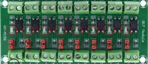

# Automatizar-a-Casa
----

## Introdução

Projeto desenvolvido para a disciplina Sistemas Embarcados da Fatec, visando implementar um sistema de baixo custo em comparação ao que encontra-se comercialmente (como CLP's) que tem como finalidade apresentar a possibilidade de **automação residencial** com o Arduino Mega, com interação simultanea de **fisica** (**_Interruptores Touch_**). 

No **_Módulo Ethernet_**, o usuário utiliza um IP de Hospedagem próprio em seu dispositivo, permitindo conexão por computador ou celular, (ou qualquer outra opção para WEB) para realizar a manobra das "cargas", respectivamente ao sistema de iluminação da residência no nosso caso.

### Lista de Itens

+ Arduino Mega;


+ Relés;


+ Módulo Ethernet;


+ Placas Touch (Interruptores);


+ Proteção de Alimentação;



+ Fonte de Alimentação 12V;


+ Lâmpadas


#### Código Utilizado 


```


```
