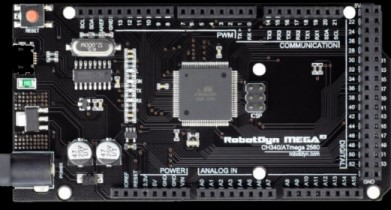

# SISTEMAS EMBARCADOS 
 1° Semestre - FATEC Jundiaí
 
 Integrantes:
 - Cristiano Francisco Correa;
 - João Felipe Gustavo;
 - Luis Gustavo do Santos Rosa;
 - Nicollas de Oliveira Juliano;
 - Rafael Massayoshi Hamazaki;
----

# Automatizar-a-Casa

----

# Sumário:

1 - Introdução;

2 - Materiais;

3 - Código-Fonte;

4 - Conclusão do Projeto;

5 - Link do vídeo;


# 1 - Introdução:

Projeto desenvolvido para a disciplina Sistemas Embarcados da Fatec, visando implementar um sistema de baixo custo em comparação ao que encontra-se comercialmente (como CLP's) que tem como finalidade apresentar a possibilidade de **automação residencial** com o Arduino Mega, com interação simultanea de **fisica** (**_Interruptores Touch_**), quanto **virtualmente** (acesso pela rede com o **_Módulo Ethernet_**). 


No **_Módulo Ethernet_**, o usuário utiliza um IP de Hospedagem próprio em seu dispositivo, permitindo conexão por computador ou celular, (ou qualquer outra opção para WEB) para realizar a manobra das "cargas", respectivamente ao sistema de iluminação da residência no nosso caso.

# 2 - Materiais utilizados:

+ Arduino Mega 2560;




+ Relés;


+ Módulo de Rede Ethernet W5500 ;


+ Placas Touch (Interruptores);


+ Módulo Opto-acoplador;

#####  - Proteção das entradas digitais entre os componentes;


+ Fonte de Alimentação 12V;


+ Lâmpadas


# 3 - Código-Fonte: 


```
int SALAESTAR = 34; 
int SALAESTAR_E = 15; 
int valor1;
int anterior1 = 0;
int estado1 = LOW;
int COZINHA =35; 
int COZINHA_E = 16; 
int valor2;
int anterior2 = 0;
int estado2 = LOW;
int LAVANDERIA = 36; 
int LAVANDERIA_E = 17; 
int valor3;
int anterior3 = 0;
int estado3 = LOW;
int BANHOSOCIAL = 37; 
int BANHOSOCIAL_E = 18; 
int valor4;
int anterior4 = 0;
int estado4 = LOW;
int BANHOSUITE = 38; 
int BANHOSUITE_E = 19; 
int valor5;
int anterior5 = 0;
int estado5 = LOW;
int QUARTO1 = 39; 
int QUARTO1_E = 20; 
int valor6;
int anterior6 = 0;
int estado6 = LOW;
int QUARTO2 = 40; 
int QUARTO2_E = 21; 
int valor7;
int anterior7 = 0;
int estado7 = LOW;
int SUITE = 41; 
int SUITE_E = 22; 
int valor8;
int anterior8 = 0;
int estado8 = LOW;
int LIGASMUL = LIGADO; 
int LIGASIMUL_E = 14; 
int valor9;
int anterior9 = 0;
int estado9 = HIGH;
//int X = X; 
//int X_E = X; 
//int valorX;
//int anteriorX = 0;
//int estadoX = LOW;

void setup() {
Serial.begin(9600);
pinMode(SALAESTAR, OUTPUT); 
pinMode(SALAESTAR_E, INPUT_PULLUP);
pinMode(COZINHA, OUTPUT); 
pinMode(COZINHA_E, INPUT_PULLUP);
pinMode(LAVANDERIA, OUTPUT); 
pinMode(LAVANDERIA_E, INPUT_PULLUP);
pinMode(BANHOSOCIAL, OUTPUT); 
pinMode(BANHOSOCIAL_E, INPUT_PULLUP);
pinMode(BANHOSUITE, OUTPUT); 
pinMode(BANHOSUITE_E, INPUT_PULLUP);
pinMode(QUARTO1, OUTPUT); 
pinMode(QUARTO1_E, INPUT_PULLUP);
pinMode(QUARTO2, OUTPUT); 
pinMode(QUARTO2_E, INPUT_PULLUP);
pinMode(SUITE, OUTPUT); 
pinMode(SUITE_E, INPUT_PULLUP);
pinMode(LIGASMUL, INPUT_PULLUP);
//pinMode(X, OUTPUT); 
//pinMode(X_E, INPUT);
}

void loop()
{
valor1 = digitalRead(SALAESTAR_E);
if (valor1 == HIGH && anterior1 == LOW) {
 estado1 = 1 - estado1;
}
digitalWrite(SALAESTAR, estado1);
anterior1 = valor1;
delay (50);

valor2 = digitalRead(COZINHA_E);
if (valor2 == HIGH && anterior2 == LOW) {
 estado2 = 1 - estado2;
}
digitalWrite(COZINHA, estado2);
anterior2 = valor2;
delay(50);

valor3 = digitalRead(LAVANDERIA_E);
if (valor3 == HIGH && anterior3 == LOW) {
 estado3 = 1 - estado3;
}
digitalWrite(LAVANDERIA, estado3);
anterior3 = valor3;
delay (50);

valor4 = digitalRead(BANHOSOCIAL_E);
if (valor4 == HIGH && anterior4 == LOW) {
 estado4 = 1 - estado4;
}
digitalWrite(BANHOSOCIAL, estado4);
anterior4 = valor4;
delay (50);

valor5 = digitalRead(BANHOSUITE_E);
if (valor5 == HIGH && anterior5 == LOW) {
 estado5 = 1 - estado5;
}
digitalWrite(BANHOSUITE, estado5);
anterior5 = valor5;
delay (50);

valor6 = digitalRead(QUARTO1_E);
if (valor6 == HIGH && anterior6 == LOW) {
  estado6 = 1 - estado6;
}
digitalWrite(QUARTO1, estado6);
anterior6 = valor6;
delay (50);

valor7 = digitalRead(QUARTO2_E);
if (valor7 == HIGH && anterior7 == LOW) {
  estado7 = 1 - estado7;
}
digitalWrite(QUARTO2, estado7);
anterior7 = valor7;
delay (50);

valor8 = digitalRead(SUITE_E);
if (valor8 == HIGH && anterior8 == LOW) {
  estado8 = 1 - estado8;
}
  digitalWrite(SUITE, estado8);
anterior8 = valor8;
delay (50);

valor9 = digitalRead(LIGASIMUL_E);
if (valor9 == HIGH && anterior9 == LOW) {
  estado9 = 1 - estado9;
}
  digitalWrite(LIGASIMUL, estado9);
anterior9 = valor9;
delay (50);
Serial.println(LIGASIMUL_E);
if (LIGADO == HIGH){
    digitalWrite(SALAESTAR, HIGH);
    delay (1500);
    digitalWrite(COZINHA, HIGH);
    delay (200);
    digitalWrite(SALAESTAR, LOW);
    delay (1300);
    digitalWrite(LAVANDERIA, HIGH);
    delay (200);
    digitalWrite (COZINHA,LOW) ;
    delay (1300);
    digitalWrite(BANHOSOCIAL, HIGH);
    delay (200);
    digitalWrite (LAVANDERIA,LOW);
    delay (1300);
    digitalWrite(BANHOSUITE, HIGH);
    delay (200);
    digitalWrite (BANHOSOCIAL,LOW);
    delay (1300);
    digitalWrite(SUITE, HIGH);
    delay (200);
    digitalWrite (BANHOSUITE, LOW) ;
    delay (1300);
    digitalWrite(QUARTO1, HIGH);
    delay (200);
    digitalWrite (SUITE,LOW);
    delay (1300);
    digitalWrite(QUARTO2, HIGH);
    delay (200);
    digitalWrite (QUARTO1,LOW);
}
//valorX = digitalRead(X_E);
//if (valorX == HIGH && anteriorX == LOW) {
// estadoX = 1 - estadoX;
//}
//digitalWrite(X, estadoX);
//anteriorX = valorX;
//delay (50);
}

```
----
# 4 - Conclusão do Projeto:

Projeto com a montagem final em placa MDF para suporte/fixação dos componentes principais e interruptores touch, juntamente a uma maquete da planta baixa conectada aos saídas/relés do circuito para simulação do protótipo e interligado ao computador para controle por meio da conexão Ethernet 


# 5 - Link do Vídeo

[Projeto Funcionando](https://www.youtube.com/watch?v=zsscLPNTAK8)
